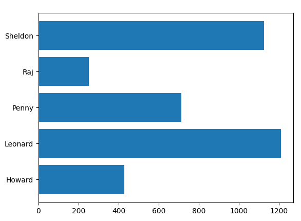

# Análisis de grupos de Whatsapp
**Autor**: Fermín Cruz.   **Revisor**: José A. Troyano, J. Mariano González, Beatriz Pontes.  **Última modificación**: 21/11/2023

En este proyecto vamos a analizar los mensajes de un grupo de Whatsapp. 

Para llevar a cabo el ejercicio, necesitamos un archivo de log de un grupo de Whatsapp. En este proyecto se proporciona un fichero de log ficticio que se puede utilizar para desarrollar los ejercicios (generado a partir de los diálogos de la primera temporada de la serie de TV *The Big Bang Theory*). Pero también puede utilizar un log de un grupo propio. Para ello, siga los pasos indicados en el apéndice *Utilización de logs propios*, al final de este documento.

El formato del fichero que genera Whatsapp varía según se trate de la versión Andriod o iOS. Veamos un ejemplo de cada caso:
* Android:
<pre>
26/02/16, 09:16 - Leonard: De acuerdo, ¿cuál es tu punto?
26/02/16, 16:16 - Sheldon: No tiene sentido, solo creo que es una buena idea para una camiseta.
</pre>
* iOS:
<pre>
[26/2/16 09:16:25] Leonard: De acuerdo, ¿cuál es tu punto?
[26/2/16 16:16:54] Sheldon: No tiene sentido, solo creo que es una buena idea para una camiseta.
</pre>

Como puede observar, cada mensaje del chat contiene la fecha y hora en que fue escrito, el nombre del usuario, y el texto del mensaje. Los mensajes del log serán almacenados en tuplas con nombre definidas de la siguiente forma:

```python
Mensaje = NamedTuple('Mensaje', [('fecha', datetime.date), ('hora', datetime.time), ('usuario', str), ('texto', str)])
```

La función ``carga_log`` se encarga de recibir la ruta del archivo de log y devolver la lista de mensajes leídos. Se proporciona implementada. Dado que el formato del log es más complejo que un CSV, se han utilizado [expresiones regulares](https://docs.python.org/es/3/howto/regex.html) para procesar las cadenas de texto y extraer cada uno de los campos de los mensajes.


Para poder generar nubes de palabras, necesitamos instalar la siguiente dependencia:
```
pip install wordcloud
```

## Ejercicios

Implemente las funciones incompletas del módulo ``analisis_whatsapp.py``, y pruébelos mediante los tests proporcionados en el módulo ``analisis_whatsapp_test.py``. 

Una vez realizados los ejercicios, puede ejecutar el módulo ``analisis_whatsapp_gui.py``, que mostrará una interfaz gráfica que le permitirá generar informes gráficos a partir del log seleccionado. 

En la primera parte de este proyecto, vamos a implementar funciones que nos permitirán generar un informe de los patrones de uso de los distintos usuarios del log. Para cada función, se muestra el resultado esperado al ejecutar el módulo ``analisis_whatsapp_test.py`` usando como fichero de log el proporcionado ``bigbangtheory_es.txt``.

### Ejercicio 1

Implemente la función ``calcula_usuarios``, que devuelve una lista ordenada y sin duplicadas de los usuarios participantes.

```
---> Test de cuenta_mensajes_por_usuario:
Los usuarios del log son: ['Howard', 'Leonard', 'Penny', 'Raj', 'Sheldon']
```

### Ejercicio 2

Implemente la función ``cuenta_mensajes_por_usuario``, que devuelve un diccionario de conteos de mensajes por usuario (es decir, para cada usuario, cuántos mensajes hay).

```
---> Test de cuenta_mensajes_por_usuario:
Howard: 428
Leonard: 1210
Penny: 712
Raj: 251
Sheldon: 1125
```

### Ejercicio 3

Implemente la función ``muestra_numero_mensajes_por_usuario``, que muestra una gráfica de barras con el número de mensajes por usuario.




### Ejercicio 4

Implemente la función ``cuenta_mensajes_por_meses``, que devuelve un diccionario de conteos de mensajes por mes/año. 

```
---> Test de cuenta_mensajes_por_meses:
01/2017: 328
02/2016: 29
02/2017: 231
03/2016: 299
03/2017: 14
04/2016: 315
05/2016: 330
06/2016: 393
07/2016: 295
08/2016: 369
09/2016: 299
10/2016: 257
11/2016: 218
12/2016: 349
```

### Ejercicio 5

Implemente la función ``cuenta_mensajes_por_dia_semana``, que devuelve un diccionario de conteos de mensajes acumulados por cada día de la semana.

```
---> Test de cuenta_mensajes_por_dia_semana:
L: 380
M: 416
X: 476
J: 547
V: 619
S: 603
D: 685
```

### Ejercicio 6

Implemente la función ``cuenta_mensajes_por_momento_del_dia``, que devuelve un diccionario de conteos de mensajes acumulados en distintos momentos del día ("MAÑANA", "TARDE" y "NOCHE").

```
---> Test de cuenta_mensajes_por_momento_del_dia:
NOCHE: 741
MAÑANA: 1454
TARDE: 1531
```

### Ejercicio 7

Implemente la función ``calcula_media_horas_entre_mensajes``, que devuelve la media de horas transcurridas entre mensajes consecutivos.

```
---> Test de calcula_media_horas_entre_mensajes:
La media de horas entre mensajes consecutivos es 2.40207158836689
```

---

En la segunda parte de este proyecto, vamos a implementar funciones que nos permitirán dibujar una nube de palabras características de un usuario del log. Para ello, definiremos la importancia de una palabra usada por un usuario mediante la siguiente fórmula:

$$
importancia_{usuario}(palabra) = \sqrt{\frac{conteo_{usuario}(palabra)}{total\_palabras_{usuario}}*\frac{total\_palabras_{resto}}{conteo_{resto}(palabra)}}$$

Donde:
* $conteo_{usuario}(palabra)$ es el número de veces que $usuario$ ha usado la palabra $palabra$ en sus mensajes.
* $conteo_{resto}(palabra)$ es el número de veces que el resto de usuarios han usado la palabra $palabra$ en sus mensajes.
* $total\_palabras_{usuario}$ es el total de palabras de todos los mensajes escritos por el usuario.
* $total\_palabras_{usuario}$ es el total de palabras de todos los mensajes escritos por el resto de usuarios.

Observe que la primera parte de la fórmula indica el ratio (de 0 a 1) del número de apariciones de una palabra en los mensajes del usuario con respecto al total de palabras de sus mensajes. La segunda parte de la fórmula es la inversa del ratio del número de apariciones de la misma palabra en los mensajes del resto de usuarios con respecto al total de palabras de sus mensajes. Así, las palabras con un alto ratio de uso por parte del usuario y un bajo ratio de uso por parte del resto serán las que obtengan una mayor importancia (y serán representadas con mayor tamaño en la nube de palabras). Hacemos la raíz cuadrada para evitar que haya valores demasiado altos y obtener así luego una mejor representación de la nube de palabras.

Para que el denominador nunca sea 0, si $conteo_{resto}(palabra)$ es igual a 0 para una palabra determinada (es decir, la palabra no ha sido usada por ningún otro usuario), entonces usaremos $conteo_{resto}(palabra) = 0.00000001$.

### Ejercicio 8

Implemente la función ``genera_conteos_palabras_usuario_y_resto``, que devuelve dos diccionarios, uno con el conteo de las palabras usadas por un usuario determinado, y otro con el conteo de las palabras usadas por el resto de usuarios.

```
---> Test de genera_conteos_palabras_usuario_y_resto:
La palabra "Entonces" fue usada
        28 veces por Sheldon y
        77 veces por el resto.

La palabra "si" fue usada
        48 veces por Sheldon y
        97 veces por el resto.

La palabra "un" fue usada
        254 veces por Sheldon y
        383 veces por el resto.

La palabra "fotón" fue usada
        1 veces por Sheldon y
        0 veces por el resto.

La palabra "se" fue usada
        120 veces por Sheldon y
        163 veces por el resto.

La palabra "dirige" fue usada
        1 veces por Sheldon y
        0 veces por el resto.

La palabra "a" fue usada
        272 veces por Sheldon y
        473 veces por el resto.

La palabra "través" fue usada
        6 veces por Sheldon y
        6 veces por el resto.

La palabra "de" fue usada
        679 veces por Sheldon y
        914 veces por el resto.

La palabra "plano" fue usada
        3 veces por Sheldon y
        1 veces por el resto.
```

### Ejercicio 9

Implemente la función ``genera_palabras_caracteristicas_usuario``, que devuelve un diccionario que relaciona cada palabra usada por un usuario en sus mensajes con el valor de importancia calculado con la fórmula anteriormente explicada. 

```
---> Test de genera_palabras_caracteristicas_usuario:
Usuario: Sheldon
    Knock -> 96905.24792734518
    ADN -> 29218.031599215385
    eran -> 29218.031599215385
    Muéstrame -> 29218.031599215385
    básica -> 26133.401929832995
    libras -> 26133.401929832995
    conversación -> 26133.401929832995
    crear -> 26133.401929832995
    lactosa -> 26133.401929832995
    Ha -> 26133.401929832995
```


## Apéndice: Utilización de logs propios

Siga los siguientes pasos, según utilice **Android** o **iOS** (*estos pasos han sido probado con las últimas versiones de Whatsapp a día 8 de noviembre de 2022, puede que con otras versiones los pasos cambien ligeramente*):

* Android:
    * Entre en Whatsapp en su móvil, y acceda al grupo que desee. Cuantos más mensajes haya en el grupo, tanto más interesante será el análisis que llevaremos a cabo.
    * Pulse en el menú contextual, y busca la opción "Exportar chat". Selecciona la opción "Sin archivo(s)".
    * Elija una aplicación para enviar el fichero resultante (por ejemplo, por correo electrónico).
    * Guarde este archivo dentro de la carpeta datos de este notebook. Puede cambiarle el nombre al fichero por uno más corto. 
 
* iOS:
    * Entre en Whatsapp en su móvil, y acceda al grupo que desee.
    * Pulse sobre el nombre del grupo, en la parte superior. Busque la opción "Exportar chat".
    * Seleccione "Sin archivos", y luego "Compartir mediante correo electrónico". Escriba su dirección de correo.
    * Acceda al email desde el ordenador, y descargue el fichero cuyo nombre acaba en txt.
    * Guarde este archivo dentro de la carpeta datos de este notebook. Puede cambiarle el nombre al fichero por uno más corto.

Si va a usar su propio log para ejecutar los tests, cambie el nombre del fichero en la variable `FICHERO` del módulo `analisis_whatsapp_test.py`, y el valor de `SO` por `"android"` o `"ios"`, según sea el caso, en el módulo `analisis_whatsapp.py`. 